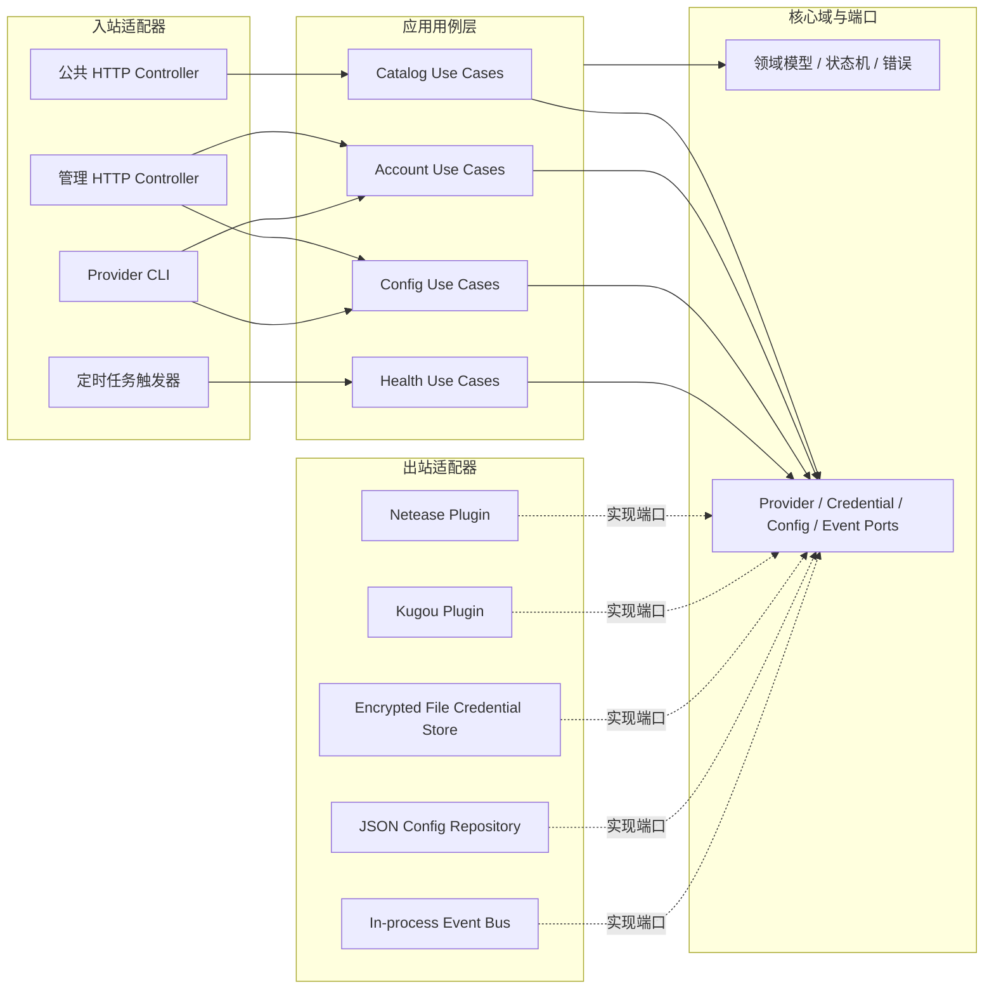
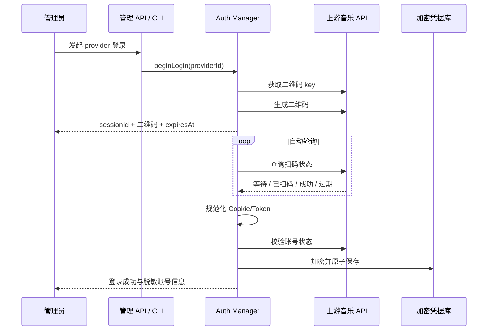

# Lune Provider 系统 V1 整体方案规划

> 文档状态：第一版方案稿  
> 基准实现：网易云音乐 `netease`、酷狗音乐 `kugou`  
> 目标读者：后端开发、客户端开发、部署运维、测试  
> 本版范围：Provider 标准化、账号登录自动化、凭据生命周期、服务端配置自动化、部署与验收

## 1. 背景与结论

Lune 已经具备可工作的 Provider 雏形：服务端通过统一 HTTP API 暴露搜索、播放地址解析、歌词和歌单能力，客户端通过 `provider` 字段区分网易云和酷狗，服务端通过 `MUSIC_PROVIDERS` 控制启用顺序。

当前最大缺口不是“再接一个 API”，而是缺少完整的账号与运行管理层：

- 网易云和酷狗登录态仍依赖人工从浏览器复制 Cookie 到 `.env`。
- 服务启动后不会系统性验证账号是否有效，也没有统一的过期、刷新和重新登录流程。
- Provider 出错时大多降级为空结果，管理端无法区分“没有结果”“上游故障”“登录失效”。
- Provider 的启停、默认顺序、超时和健康检查都是静态环境变量，缺少校验、初始化和部署生成工具。
- 生产部署仍需要手工编译、复制 `dist`、维护 `.env` 和重启进程，容易产生版本或配置漂移。

V1 建议形成以下闭环：

1. 管理员通过二维码完成一次交互式授权，不保存账号密码。
2. 服务端自动捕获 Cookie/Token，并加密持久化。
3. Provider 启动时自动加载凭据，运行中定时校验并在支持时刷新。
4. 登录失效后进入明确状态并告警，由管理员重新扫码，不把失效伪装成空搜索结果。
5. 非敏感配置进入版本化配置文件；密钥只通过环境变量或密钥服务注入。
6. 用 CLI 完成初始化、登录、诊断、配置校验和部署包生成。

“账号登录自动化”在 V1 中指授权后的全生命周期自动化，不包含绕过验证码、模拟破解登录或长期保存明文密码。

## 2. 当前实现基线

### 2.1 已有能力

| 范围 | 当前实现 |
|---|---|
| Provider 注册 | `ProviderRegistry` 注册 `netease`、`kugou` |
| 启用与默认源 | `MUSIC_PROVIDERS=netease,kugou`，第一个为默认源 |
| 公共能力 | 搜索、播放地址解析、歌词、歌单详情、歌单搜索 |
| 网易云鉴权 | `MUSIC_COOKIE` 注入所有网易云请求 |
| 酷狗鉴权 | `KUGOU_COOKIE` 注入酷狗程序化 API |
| 客户端路由 | `Track.provider` 与显式 `provider` 查询参数 |
| 部署 | 独立的 `server-deploy` 目录，可使用 Node.js + PM2 运行 |

现有业务 API：

| 路由 | 用途 |
|---|---|
| `GET /api/providers` | 获取启用的 Provider ID |
| `GET /api/providers/search` | 搜索歌曲 |
| `GET /api/providers/resolve` | 解析播放地址 |
| `GET /api/providers/lyric` | 获取歌词 |
| `GET /api/providers/playlist-search` | 搜索歌单 |
| `GET /api/providers/playlist` | 获取歌单歌曲 |

### 2.2 已确认的上游登录能力

网易云当前依赖提供：

- `login_qr_key`：生成登录 key。
- `login_qr_create`：生成二维码 URL 或 Base64 图片。
- `login_qr_check`：轮询状态；`800` 过期、`801` 等待扫码、`802` 已扫码待确认、`803` 登录成功并返回 Cookie。
- `login_status`：校验当前 Cookie 对应的账号状态。
- `login_refresh`：上游文档明确说明不支持刷新二维码登录获得的 Cookie，因此不能把它作为二维码登录态的可靠续期方案。

酷狗当前依赖提供：

- `login_qr_key`：生成登录 key。
- `login_qr_create`：生成二维码 URL 或 Base64 图片。
- `login_qr_check`：轮询状态；`0` 过期、`1` 等待扫码、`2` 待确认、`4` 登录成功并返回 `token`、`userid` 等 Cookie。
- `login_token`：基于现有 Token 刷新登录态，并可能返回新的 Token、VIP 信息和设备相关 Cookie。

### 2.3 当前主要问题

1. Provider 业务能力与账号凭据读取耦合在一起，直接读取 `process.env`。
2. 没有 Provider 元数据与能力声明，客户端只能识别硬编码的 ID 和名称。
3. 没有统一错误模型、超时、重试、熔断和运行状态。
4. 没有独立的管理面；账号管理若直接放进公共 `/api/providers` 会带来高风险。
5. 凭据只有“启动前配置”一种方式，无法安全热更新。
6. `NeteaseCloudMusicApi` 使用范围版本，实际安装版本可能随 lockfile 变化；登录适配层需要固定并验证精确版本。

## 3. V1 目标与非目标

### 3.1 V1 目标

- 用统一协议管理网易云、酷狗，并能按相同方式增加第三个 Provider。
- 支持两个 Provider 的二维码登录完整状态机。
- 自动采集、规范化、加密保存和加载登录凭据。
- 自动校验登录状态；酷狗支持 Token 刷新；网易云失效后明确要求重新扫码。
- 支持 Provider 启用、禁用、排序、默认源、超时和健康检查配置。
- 提供安全的管理 API 和本地 CLI，不在公共客户端暴露 Cookie、Token 或登录操作。
- 提供可重复执行的初始化、诊断、打包和部署配置生成流程。
- 保持现有客户端和房间协议兼容。

### 3.2 V1 非目标

- 不保存网易云或酷狗账号明文密码。
- 不自动处理短信验证码、滑块、人机验证或设备风控。
- 不在不同音乐平台之间自动映射同一首歌。
- 不承诺绕过会员、版权、地区或音质限制。
- 不在 V1 引入复杂的多租户账号计费和用户级账号绑定。
- 不把第三方非官方 API 当成稳定 SLA；V1 只建立隔离和快速修复能力。

## 4. 总体架构

V1 采用模块化单体与六边形架构。所有模块仍运行在一个 NestJS 进程中，但核心逻辑只依赖 TypeScript 接口，不依赖 NestJS、文件系统、环境变量或具体第三方 SDK。这样既保留当前部署简单的优势，又能在后续按实际需要替换存储、增加管理页、支持多账号，甚至拆分独立服务。



### 4.1 设计原则

1. **依赖向内**：Controller、CLI、定时任务和第三方 SDK 都依赖核心端口，核心域不反向依赖它们。
2. **业务与认证分离**：音乐搜索和账号登录是两个独立端口；不需要登录的 Provider 可以只实现音乐能力。
3. **策略与机制分离**：超时、重试、熔断属于运行策略，上游字段转换属于 Provider 插件，两者不能混在业务用例中。
4. **写入与读取分离**：公共 API 只读 Provider 能力和运行状态；配置、登录和凭据变更只通过管理用例完成。
5. **组合优于继承**：Provider 不继承庞大的基类，按能力组合 `catalog`、`auth`、`healthProbe` 等小接口。
6. **扩展开放、核心封闭**：新增 Provider 主要增加一个插件目录和注册声明，不修改搜索、登录或配置用例。
7. **先模块化再服务化**：V1 使用进程内调用和类型化事件，不引入 RPC、Kafka 或独立认证服务。

### 4.2 模块边界

| 模块 | 职责 | 不负责 |
|---|---|---|
| `provider-domain` | ID、能力、凭据、登录状态、运行状态、领域错误 | HTTP、NestJS、SDK 调用、文件读写 |
| `provider-application` | 搜索、解析、登录、刷新、配置变更、健康检查用例 | 上游字段解析、加密算法细节 |
| `provider-registry` | 插件注册、能力索引、按 ID 查找 | 登录轮询、配置持久化、业务降级 |
| `provider-runtime` | 超时、重试、熔断、并发控制、状态聚合 | 具体音乐平台协议 |
| `credential-store` | 凭据加密、版本迁移、原子保存和读取 | 判断账号是否有效 |
| `config-repository` | 非敏感配置加载、校验、变更和持久化 | 保存 Cookie/Token |
| `provider-plugin-*` | 第三方 API 调用、字段映射、状态码翻译 | HTTP Controller、部署配置 |
| `provider-interface-http` | DTO、鉴权、HTTP 状态码与用例调用 | 直接调用上游 SDK |
| `provider-interface-cli` | 参数解析、二维码显示、自动化输出 | 重复实现登录或配置逻辑 |
| `provider-bootstrap` | NestJS DI 绑定和进程启动顺序 | 领域决策 |

### 4.3 依赖规则

允许的依赖方向：

```text
HTTP / CLI / Scheduler
        ↓
Application Use Cases
        ↓
Domain Models + Ports
        ↑
Provider Plugins / File Store / Config Store / Event Adapter
```

必须由代码检查或评审保证：

- `domain` 不导入 `@nestjs/*`、`node:fs`、`process.env`、网易云或酷狗 SDK。
- `application` 不读取环境变量，不拼接 Cookie，不解析第三方响应。
- Controller 和 CLI 不直接访问 `CredentialStore` 或第三方 SDK，只调用应用用例。
- 一个 Provider 插件不能导入另一个 Provider 插件。
- 公共 API 不能调用管理写用例。
- 只有 `bootstrap` 组合根知道接口最终绑定到了哪个实现。

### 4.4 避免中心化“大 Manager”

不要创建同时负责注册、路由、登录、配置、刷新、健康检查和日志的单一 `ProviderManager`。应用层按用例拆分为小服务：

- `SearchTracksUseCase`
- `ResolveTrackUseCase`
- `GetLyricsUseCase`
- `BeginProviderLoginUseCase`
- `GetLoginSessionUseCase`
- `ValidateProviderCredentialUseCase`
- `RefreshProviderCredentialUseCase`
- `UpdateProviderConfigUseCase`
- `GetProviderStatusUseCase`

用例可以共享纯策略组件，例如 `ProviderSelector`、`RetryPolicy` 和 `ProviderStatusProjector`，但不得通过一个万能服务互相调用。

### 4.5 进程内事件解耦

账号用例不直接通知每个业务 Provider 或告警渠道，而是在事务完成后发布类型化领域事件：

```ts
type ProviderDomainEvent =
  | { type: 'provider.credential-updated'; providerId: string; version: number }
  | { type: 'provider.auth-required'; providerId: string; reason: string }
  | { type: 'provider.status-changed'; providerId: string; from: string; to: string }
  | { type: 'provider.config-updated'; providerId: string; revision: number };
```

订阅者各自完成凭据快照重载、状态投影、审计或告警。V1 的事件总线为进程内实现；事件载荷只传 ID、版本和状态，不传 Cookie/Token。未来需要多实例时可替换事件适配器，不修改登录用例。

关键写操作仍以凭据库或配置库成功落盘为准，事件只是提交后的通知，不能把事件总线当成唯一数据源。

### 4.6 推荐目录结构

可在不一次性搬动全部旧代码的前提下逐步收敛到：

```text
server/src/providers/
├─ domain/
│  ├─ models/
│  ├─ errors/
│  └─ events/
├─ application/
│  ├─ ports/
│  └─ use-cases/
├─ runtime/
│  ├─ provider.registry.ts
│  ├─ provider-status.store.ts
│  └─ policies/
├─ infrastructure/
│  ├─ credentials/
│  ├─ config/
│  └─ events/
├─ plugins/
│  ├─ netease/
│  │  ├─ netease.plugin.ts
│  │  ├─ netease-catalog.adapter.ts
│  │  ├─ netease-auth.adapter.ts
│  │  ├─ netease.client.ts
│  │  └─ netease.mapper.ts
│  └─ kugou/
│     ├─ kugou.plugin.ts
│     ├─ kugou-catalog.adapter.ts
│     ├─ kugou-auth.adapter.ts
│     ├─ kugou.client.ts
│     └─ kugou.mapper.ts
├─ interfaces/
│  ├─ http/
│  └─ cli/
└─ provider-bootstrap.module.ts
```

初期迁移时允许旧 Controller 保留原路径，但新增核心代码应遵循上述依赖边界。

## 5. 核心领域模型

### 5.1 Provider 描述

在现有 `MusicProvider` 之外增加描述和运行信息，不让客户端继续硬编码名称：

```ts
type ProviderCapability =
  | 'search'
  | 'resolve'
  | 'lyric'
  | 'playlist-search'
  | 'playlist';

interface ProviderDescriptor {
  id: string;
  displayName: string;
  capabilities: ProviderCapability[];
  requiresAccount: boolean;
}

type ProviderRuntimeStatus =
  | 'disabled'
  | 'starting'
  | 'ready'
  | 'degraded'
  | 'auth-required'
  | 'unavailable';
```

### 5.2 账号驱动协议

登录能力应与音乐业务能力解耦：

```ts
interface ProviderAuthDriver {
  readonly providerId: string;
  beginLogin(): Promise<LoginChallenge>;
  pollLogin(session: LoginSession): Promise<LoginPollResult>;
  validate(credential: ProviderCredential): Promise<AccountSnapshot>;
  refresh?(credential: ProviderCredential): Promise<ProviderCredential>;
  logout?(credential: ProviderCredential): Promise<void>;
}
```

统一登录状态：

```ts
type LoginState =
  | 'created'
  | 'waiting-scan'
  | 'waiting-confirm'
  | 'authorized'
  | 'expired'
  | 'failed'
  | 'cancelled';
```

上游状态码只能存在于各自 Auth Driver 内部，对外统一转换为上述状态。

### 5.3 凭据模型

```ts
interface ProviderCredentialEnvelope {
  schemaVersion: 1;
  providerId: string;
  accountId?: string;
  accountName?: string;
  cookie: Record<string, string>;
  issuedAt: string;
  updatedAt: string;
  lastValidatedAt?: string;
  expiresAt?: string;
  metadata?: Record<string, string | number | boolean>;
}
```

约束：

- 内存和落盘统一使用结构化 Cookie，不长期保留未经解析的字符串。
- 对上游发请求时才序列化成各 API 所需格式。
- 对日志、错误和管理 API 输出统一脱敏。
- 凭据写入必须采用临时文件 + 原子替换，避免进程中断造成损坏。
- 每次更新保留 `schemaVersion`，便于后续迁移。

### 5.4 小粒度端口设计

核心层按能力定义端口，避免所有 Provider 被迫实现一个持续膨胀的接口：

```ts
interface SearchPort {
  search(input: SearchInput, context: ProviderRequestContext): Promise<ProviderSearchResult>;
}

interface TrackResolvePort {
  resolve(input: ResolveInput, context: ProviderRequestContext): Promise<ProviderResolveResult>;
}

interface LyricsPort {
  lyric(input: LyricInput, context: ProviderRequestContext): Promise<ProviderLyricResult>;
}

interface PlaylistPort {
  searchPlaylists?(input: PlaylistSearchInput, context: ProviderRequestContext): Promise<ProviderPlaylistSearchResult>;
  playlist?(input: PlaylistInput, context: ProviderRequestContext): Promise<Track[]>;
}

interface CredentialStorePort {
  get(providerId: string): Promise<ProviderCredentialEnvelope | null>;
  put(expectedVersion: number | null, credential: ProviderCredentialEnvelope): Promise<number>;
  remove(providerId: string): Promise<void>;
}

interface ProviderConfigRepositoryPort {
  getSnapshot(): Promise<ProviderConfigSnapshot>;
  update(expectedRevision: number, change: ProviderConfigChange): Promise<number>;
}
```

`ProviderRequestContext` 由应用层创建，可包含请求 ID、超时信号和凭据只读快照。它不能暴露凭据存储的写权限。

写接口带 `expectedVersion` 或 `expectedRevision`，用乐观并发避免定时刷新、人工重新登录和配置修改互相覆盖。

### 5.5 Provider 插件契约

每个插件通过一个 Manifest 聚合自己实现的能力，注册中心不直接构造具体类：

```ts
interface ProviderPlugin {
  descriptor: ProviderDescriptor;
  catalog: {
    search: SearchPort;
    resolve: TrackResolvePort;
    lyrics?: LyricsPort;
    playlists?: PlaylistPort;
  };
  auth?: ProviderAuthDriver;
  healthProbe?: ProviderHealthProbe;
}

type ProviderPluginFactory = (deps: ProviderPluginDependencies) => ProviderPlugin;
```

插件只接收受限依赖，例如 HTTP Client、时钟和凭据读取器。新增 Provider 的标准动作应当是：

1. 新建插件目录并实现所需端口。
2. 声明 Manifest、能力和配置 Schema 片段。
3. 在组合根增加一条插件工厂注册。
4. 运行通用 Provider 契约测试。

除组合根的注册声明外，不应修改公共 Controller、账号用例、凭据库或现有 Provider。

## 6. 账号登录自动化设计

### 6.1 通用二维码登录流程



推荐由服务端后台任务轮询，上层 CLI 或管理页只查询 Lune 的登录会话状态。这样不会让浏览器直接接触上游 Token，也不会因关闭管理页而丢失已完成授权的结果。

默认策略：

- 登录会话只保存在内存，重启后失效。
- 同一 Provider 同时只允许一个活跃登录会话。
- 轮询间隔默认 2 秒，加入 0～500 毫秒随机抖动。
- 单次登录最长 180 秒，以实际上游过期状态为最终依据。
- 成功、过期、失败或取消后立即停止轮询。
- 二维码和 `sessionId` 不写入日志。
- 连续网络错误采用有限退避，不把网络错误误判为二维码过期。

### 6.2 网易云登录流程

1. 调用 `login_qr_key` 获取 `unikey`。
2. 调用 `login_qr_create({ key, qrimg: true })` 获取二维码。
3. 调用 `login_qr_check({ key, timestamp })` 轮询：
   - `800` → `expired`
   - `801` → `waiting-scan`
   - `802` → `waiting-confirm`
   - `803` → `authorized`
4. 从成功响应中提取完整 Cookie，至少保留 `MUSIC_U`，但不得只保存单字段，以免后续接口需要其他会话字段。
5. 使用 `login_status({ cookie })` 二次校验，并提取账号 ID、昵称等非敏感摘要。
6. 校验成功后替换现有凭据，并触发 `NeteaseProvider` 热更新。

续期策略：

- 每 30 分钟做一次轻量状态校验，启动时立即校验一次。
- 连续 2 次校验失败才进入 `auth-required`，避免瞬时网络错误误伤。
- 二维码 Cookie 不依赖 `login_refresh` 自动续期；确认失效后通知管理员重新扫码。
- 在登录失效前保留最后一次凭据，但停止把它标记为健康；新凭据写入成功后再原子替换旧值。

### 6.3 酷狗登录流程

1. 调用 `login_qr_key` 获取二维码 key。
2. 调用 `login_qr_create({ key, qrimg: true })` 获取二维码。
3. 调用 `login_qr_check({ key, timestamp })` 轮询：
   - `0` → `expired`
   - `1` → `waiting-scan`
   - `2` → `waiting-confirm`
   - `4` → `authorized`
4. 合并响应中的 Cookie 数组和账号数据，至少验证 `token`、`userid`，并保留 `dfid`、设备标识、VIP Token 等上游返回字段。
5. 用 `login_token` 进行一次登录态确认；若上游返回轮换后的字段，以最新值覆盖。
6. 加密保存凭据并触发 `KugouProvider` 热更新。

续期策略：

- 启动时调用一次 `login_token` 校验并同步可能轮换的 Token。
- 每 6 小时尝试刷新，具体间隔由配置控制并加入随机抖动。
- 刷新成功后立即原子更新凭据；失败不立刻清空旧凭据。
- 连续失败且业务探针同时确认未登录时，进入 `auth-required`。

### 6.4 登录态切换原则

- Provider 通过 `CredentialProvider` 获取当前不可变快照，不再直接读取 `process.env`。
- 凭据热更新使用“新凭据校验成功后交换引用”，进行中的请求继续使用旧快照。
- 退出登录先停止新请求，再调用上游退出能力（如可用），最后清除本地凭据。
- 清除凭据属于管理操作，必须二次确认；默认保留一份短期可恢复的加密备份不超过 24 小时。

## 7. 凭据存储与安全

### 7.1 V1 存储方案

单实例服务器使用本地加密文件即可满足第一版：

```text
<LUNE_DATA_DIR>/
├─ provider-credentials.enc.json
├─ provider-credentials.enc.json.bak
└─ audit/
   └─ provider-admin.jsonl
```

建议采用 AES-256-GCM：

- 主密钥通过 `LUNE_MASTER_KEY` 注入，不写入配置文件或仓库。
- 每次加密使用随机 nonce，并保存认证标签。
- 文件只授予服务进程用户读写权限。
- 日志不得出现 Cookie、Token、二维码 key、主密钥或完整上游响应。
- 管理 API 只返回 `hasCredential`、账号摘要、校验时间和状态。

多实例或更高安全要求时，再把相同 `CredentialStore` 接口替换为 Vault、云 KMS 或数据库，不改变 Provider 和 Auth Driver。

### 7.2 管理面保护

- 管理 API 与公共业务 API 分开：`/api/admin/providers/*`。
- 默认只监听回环地址或仅通过 SSH 隧道访问。
- V1 使用独立的 `LUNE_ADMIN_TOKEN`；必须是高强度随机值，并进行恒定时间比较。
- 增加速率限制、失败审计和请求 ID。
- 生产环境禁止通过 Query String 传管理 Token。
- CORS 不对管理路由开放任意来源。
- 后续若提供管理页面，再增加短会话、CSRF 防护和角色权限。

## 8. 配置自动化设计

### 8.1 配置分层

将配置拆为三类：

| 类别 | 示例 | 存放位置 |
|---|---|---|
| 可提交的运行策略 | Provider 启停、顺序、超时、刷新周期 | `config/providers.json` |
| 启动密钥与环境差异 | 主密钥、管理 Token、端口、数据目录 | `.env` 或部署平台 Secret |
| Provider 登录凭据 | Cookie、Token、账号摘要 | 加密凭据库 |

建议的非敏感配置：

```json
{
  "schemaVersion": 1,
  "defaultProvider": "netease",
  "providers": {
    "netease": {
      "enabled": true,
      "requestTimeoutMs": 10000,
      "healthCheckIntervalMs": 1800000
    },
    "kugou": {
      "enabled": true,
      "requestTimeoutMs": 10000,
      "healthCheckIntervalMs": 1800000,
      "refreshIntervalMs": 21600000
    }
  },
  "routing": {
    "failureThreshold": 3,
    "circuitOpenMs": 30000
  }
}
```

环境变量缩减为：

```dotenv
PORT=9527
LUNE_CONFIG_FILE=/opt/lune/config/providers.json
LUNE_DATA_DIR=/opt/lune/data
LUNE_MASTER_KEY=<32-byte-base64-key>
LUNE_ADMIN_TOKEN=<strong-random-token>
JWT_SECRET=<strong-random-token>
```

兼容期继续读取 `MUSIC_PROVIDERS`、`MUSIC_COOKIE`、`KUGOU_COOKIE`，但只用于一次迁移，成功写入新配置和凭据库后给出弃用警告。

### 8.2 配置加载顺序

```text
内置安全默认值
  < providers.json
  < 环境变量覆盖项
  < 运行时管理操作（仅允许白名单字段）
```

启动必须先完成配置 Schema 校验。处理策略：

- 主密钥、JWT 密钥或配置结构非法：启动失败并输出不含敏感值的明确错误。
- 某个 Provider 配置非法：该 Provider 标记为 `disabled`，其他 Provider 可继续启动。
- 默认 Provider 未启用：启动失败，不能静默选择另一个源。
- 凭据缺失或失效：进程可启动，但该 Provider 为 `auth-required`。

### 8.3 CLI 规划

建议增加统一入口 `pnpm lune-provider <command>`：

| 命令 | 作用 |
|---|---|
| `init` | 创建配置、数据目录和随机密钥模板 |
| `config validate` | 校验配置 Schema、Provider ID 和默认源 |
| `config set-enabled <id> <bool>` | 安全修改启停状态并原子写入 |
| `login <id>` | 发起二维码登录，在终端显示二维码并等待完成 |
| `status [id]` | 显示账号摘要、凭据状态和运行健康度 |
| `refresh <id>` | 手动触发凭据刷新或校验 |
| `logout <id>` | 撤销登录并清除本地凭据 |
| `doctor` | 检查 Node 版本、配置、权限、上游连通性和 API 依赖导出 |
| `deploy pack` | 编译并生成可重复部署的服务端制品 |

所有写操作都应支持 `--dry-run`；非交互式部署支持 `--json` 输出，便于脚本判断结果。

### 8.4 启动自动化

服务端启动顺序：

1. 加载并校验环境变量。
2. 加载 `providers.json` 并检查 Schema 版本。
3. 初始化加密凭据库。
4. 如发现旧 Cookie 环境变量，执行幂等迁移。
5. 注册全部已编译 Provider。
6. 按配置启用 Provider 并加载凭据快照。
7. 并行执行账号校验和轻量业务探针。
8. 启动公共 API；就绪探针根据至少一个 Provider 可用与否返回结果。
9. 启动定时验证、刷新和健康检查任务。

建议区分：

- `GET /api/health/live`：进程存活即为成功。
- `GET /api/health/ready`：配置有效且至少一个启用 Provider 可提供核心能力。
- `GET /api/admin/providers/status`：返回每个 Provider 的详细脱敏状态。

## 9. API 规划

### 9.1 公共业务 API

保持现有路由兼容，仅增强 `GET /api/providers`：

```json
{
  "providers": [
    {
      "id": "netease",
      "displayName": "网易云音乐",
      "capabilities": ["search", "resolve", "lyric", "playlist-search", "playlist"],
      "status": "ready"
    }
  ],
  "defaultProvider": "netease"
}
```

兼容策略：客户端升级期间可临时同时返回旧的 ID 数组字段，或提供 `/api/providers?format=v2`；最终应通过共享类型完成一次原子升级。

业务错误统一为：

```json
{
  "code": "PROVIDER_AUTH_REQUIRED",
  "message": "音乐源需要重新登录",
  "provider": "netease",
  "requestId": "...",
  "retryable": false
}
```

建议错误码：

- `PROVIDER_NOT_FOUND`
- `PROVIDER_DISABLED`
- `PROVIDER_AUTH_REQUIRED`
- `PROVIDER_RATE_LIMITED`
- `PROVIDER_UPSTREAM_TIMEOUT`
- `PROVIDER_UPSTREAM_ERROR`
- `TRACK_UNPLAYABLE`

“搜索无结果”仍返回空数组；登录失效和上游故障必须返回可识别错误，不能再统一吞掉。

### 9.2 管理 API

| 方法与路由 | 作用 |
|---|---|
| `GET /api/admin/providers` | 获取全部 Provider 配置和脱敏状态 |
| `POST /api/admin/providers/:id/login` | 创建二维码登录会话 |
| `GET /api/admin/providers/:id/login/:sessionId` | 查询会话状态 |
| `DELETE /api/admin/providers/:id/login/:sessionId` | 取消登录 |
| `POST /api/admin/providers/:id/validate` | 立即校验登录态 |
| `POST /api/admin/providers/:id/refresh` | 立即刷新登录态 |
| `POST /api/admin/providers/:id/logout` | 退出并清除凭据 |
| `PATCH /api/admin/providers/:id/config` | 修改允许热更新的非敏感配置 |

二维码响应可以返回 Data URL，但不得缓存；响应头使用 `Cache-Control: no-store`。

## 10. Provider 路由与故障处理

### 10.1 路由原则

- 搜索请求可使用默认 Provider，也可显式指定 Provider。
- `Track.provider` 一旦生成就是播放解析的强路由依据。
- 不允许因为原 Provider 故障就拿同一个 `Track.id` 请求另一个 Provider。
- 多源搜索和跨源同曲匹配属于后续独立能力，需要标准曲目标识、时长容差和人工消歧。

### 10.2 超时、重试和熔断

- 搜索、歌词：允许对网络错误重试 1 次。
- 播放地址解析：默认不自动重试，避免生成 URL 的重复副作用和额外延迟；可针对明确的瞬时网络错误重试 1 次。
- 登录检查：按登录状态机轮询，不使用业务请求重试策略。
- 429 或上游限流：尊重 `Retry-After`，没有该字段时指数退避。
- 连续失败达到阈值后打开熔断器；探测恢复后半开，再恢复服务。
- 所有外部请求必须有超时和 `requestId`。

### 10.3 后续功能的扩展位置

| 后续需求 | 新增或替换的模块 | 原有模块是否需要修改 |
|---|---|---|
| 接入 QQ 音乐等新平台 | 新 Provider 插件 + Manifest | 仅组合根增加注册声明 |
| 增加 Redis 缓存 | 实现缓存端口并包装查询用例 | Provider 插件不改 |
| 增加 Web 管理页 | 新增管理页面，复用管理 API | Auth Driver 和凭据库不改 |
| 支持多个平台账号 | 扩展账号聚合与凭据键模型 | 音乐端口保持不变 |
| 单机文件改数据库 | 替换 Credential/Config Repository | Provider 与用例不改 |
| 多实例部署 | 替换存储、事件和分布式锁适配器 | 领域状态机不改 |
| 增加告警渠道 | 订阅领域事件的新适配器 | 登录与健康用例不改 |
| 跨源聚合搜索 | 新增聚合搜索用例和曲目匹配策略 | 单 Provider 插件不改 |
| 下载、收藏等新能力 | 新增独立能力端口 | 不扩张已有搜索接口 |

如果一个新功能需要同时修改两个现有 Provider、Controller、凭据存储和注册中心，说明边界设计出现泄漏，应先抽取新的端口或应用用例，而不是继续增加条件分支。

## 11. 可观测性

### 11.1 日志

结构化字段至少包含：

- `requestId`
- `providerId`
- `operation`
- `durationMs`
- `result`
- `upstreamCode`
- `accountState`

禁止记录：Cookie、Token、二维码 key、手机号、密码、完整上游响应和可直接登录的 URL。

### 11.2 指标

- 每个 Provider、每个操作的请求量、成功率和延迟。
- 登录态校验成功/失败次数。
- Token 刷新成功/失败次数。
- 熔断器状态与切换次数。
- `auth-required` 持续时间。
- 播放地址不可用率。

V1 可以先输出结构化日志，指标接口作为第二阶段实现，但代码应预留统一事件出口。

## 12. 部署自动化

### 12.1 可重复部署制品

`deploy pack` 生成内容建议如下：

```text
lune-server-release/
├─ dist/
├─ package.json
├─ package-lock.json
├─ config/
│  ├─ providers.example.json
│  └─ provider-config.schema.json
├─ scripts/
│  ├─ lune-provider.js
│  └─ migrate-legacy-credentials.js
├─ .env.example
├─ ecosystem.config.cjs
├─ RELEASE.json
└─ README.md
```

`RELEASE.json` 记录 Git 提交、构建时间、Node 版本、上游依赖精确版本和配置 Schema 版本。打包过程中必须检查工作区构建成功、生产依赖可安装且登录相关函数存在。

### 12.2 首次部署流程

```bash
npm ci --omit=dev
node scripts/lune-provider.js init
node scripts/lune-provider.js config validate
node scripts/lune-provider.js login netease
node scripts/lune-provider.js login kugou
node scripts/lune-provider.js doctor
pm2 start ecosystem.config.cjs
```

生产主密钥和管理 Token 应由部署平台生成并注入；若 CLI 本地生成，只输出一次并要求操作者立即存入安全位置。

### 12.3 升级与回滚

- 代码制品使用带版本号的目录，`current` 指向当前版本。
- 数据目录与发布目录分离，升级不会覆盖加密凭据。
- 启动新版本前执行配置和凭据 Schema 只读检查。
- 数据迁移先备份再执行，迁移脚本必须幂等。
- 健康检查通过后再切换流量；失败时回到上一版代码。
- 回滚代码不自动降级凭据 Schema，涉及不可逆迁移时必须在发布说明中阻断。

## 13. 测试策略

### 13.1 单元测试

- 两套上游状态码到统一登录状态的映射。
- Cookie 数组、字符串和对象之间的规范化。
- AES-GCM 加密、解密、错误主密钥和篡改检测。
- 凭据原子写入和备份恢复。
- 配置 Schema、默认 Provider 和非法字段校验。
- Provider 错误到统一业务错误的映射。
- 酷狗 Token 刷新后字段合并。

### 13.2 集成测试

- 使用录制并脱敏的上游响应验证两个二维码登录状态机。
- 登录成功后热更新凭据，不重启即可搜索和解析。
- 凭据过期后状态切换为 `auth-required`。
- 旧环境变量向新凭据库迁移，重复执行不产生重复数据。
- 服务重启后可解密加载凭据。

### 13.3 端到端验收

对网易云和酷狗分别执行：

1. 无凭据启动，状态为 `auth-required`。
2. CLI 发起二维码登录并扫码确认。
3. 登录完成后检查账号摘要，不显示任何敏感字段。
4. 搜索歌曲、搜索歌单、导入歌单、解析播放地址、获取歌词。
5. 重启服务，确认无需重新登录即可继续使用。
6. 人为放入无效 Token，确认健康检查识别且公共 API 返回明确错误。
7. 重新扫码，确认在不重启服务的情况下恢复。

## 14. 实施阶段与交付物

### 阶段 A：协议与配置骨架

建议工期：1～2 个开发日。

- 建立纯 TypeScript 的 Domain、Application Ports 和 Use Cases 目录。
- 扩展 Provider 描述、能力与统一错误类型。
- 定义 `ProviderPlugin` Manifest 与组合根，现有两个 Provider 通过适配器接入。
- 引入配置 Schema 和 `ProviderConfigService`。
- 增加 `CredentialStorePort` 与只读凭据快照接口，去除 Provider 对 `process.env` 的直接依赖。
- 加入架构依赖测试，阻止 Domain 导入 NestJS、Node I/O 或第三方 SDK。
- 保持旧环境变量兼容。

交付物：核心端口、用例骨架、插件契约、组合根、共享类型、配置示例、架构与兼容性测试。

### 阶段 B：凭据库与双 Provider 登录

建议工期：2～4 个开发日。

- 实现加密凭据库。
- 实现网易云二维码 Auth Driver。
- 实现酷狗二维码 Auth Driver 和 Token 刷新。
- 实现登录会话状态机和热更新。

交付物：Auth Driver、凭据迁移、单元/集成测试。

### 阶段 C：管理 API 与 CLI

建议工期：2～3 个开发日。

- 实现管理 Token、防缓存、限流和审计。
- 实现登录、状态、刷新、退出和诊断命令。
- 终端二维码显示和 JSON 自动化输出。

交付物：管理 API、CLI、操作手册。

### 阶段 D：运行治理与部署自动化

建议工期：2～3 个开发日。

- 统一错误、超时、重试、熔断与状态探针。
- 构建发布包、PM2 配置和版本清单。
- 补齐升级、回滚和故障处理文档。

交付物：可部署制品、健康检查、发布与回滚验证记录。

整体预计为 7～12 个开发日，取决于两个上游 API 在真实账号和服务器网络环境中的稳定性。建议每完成一个阶段就形成可运行版本，不把所有风险留到最终联调。

## 15. V1 验收标准

满足以下条件才能认定 V1 完成：

- 网易云和酷狗均可由 CLI 或受保护管理 API 发起二维码登录。
- 扫码后无需人工复制 Cookie，凭据自动加密保存并热加载。
- 服务重启后能恢复有效登录态。
- 酷狗 Token 能按配置刷新并持久化轮换结果。
- 网易云登录失效时能明确提示重新扫码，不静默表现为空结果。
- 配置可通过 Schema 校验，非法默认 Provider 会阻止错误启动。
- 公共 API、日志和管理状态响应中均不存在 Cookie/Token 泄露。
- 旧的三个环境变量可以幂等迁移，且有明确弃用提示。
- `doctor` 能检查配置、文件权限、依赖导出、登录状态和核心业务探针。
- 发布包可在一台干净的 Node.js 20 服务器上按文档完成初始化、登录、启动、重启和回滚。
- 两个 Provider 的搜索、解析、歌词、歌单相关回归测试通过。
- 核心 Domain 和 Application 层不依赖 NestJS、文件系统、环境变量或具体音乐 SDK。
- 用一个 Fake Provider 验证：除组合根注册外，不修改既有业务代码即可接入并通过通用契约测试。

## 16. 风险与应对

| 风险 | 影响 | 应对 |
|---|---|---|
| 第三方非官方 API 变更 | 登录或业务接口突然失效 | 固定精确版本、上游适配隔离、启动时检查导出、契约测试 |
| 上游风控或验证码 | 无法完全无人值守登录 | 采用管理员扫码授权，明确进入 `auth-required` 并告警 |
| Cookie/Token 泄露 | 账号安全风险 | 加密落盘、最小权限、日志脱敏、管理面隔离、密钥轮换 |
| 单机凭据文件损坏 | Provider 无法登录 | 原子写入、认证加密、最近备份、启动恢复检测 |
| 上游短时故障被当成过期 | 触发不必要重登 | 网络错误与未登录错误分离，连续验证 + 业务探针确认 |
| 自动跨源降级产生错误歌曲 | 播放内容不一致 | Track 强绑定 Provider，V1 禁止跨源复用 ID |
| 配置热更新导致请求竞态 | 部分请求失败 | 不可变凭据快照、校验后交换、在途请求继续使用旧值 |

## 17. 需要在编码前确认的产品决策

以下决策不阻碍按本方案搭建底层，但会影响管理端实现形式：

1. V1 只提供服务器 CLI，还是同时提供一个仅管理员可见的 Web 管理页？建议第一版先交付 CLI，管理 API 保留给后续页面使用。
2. 服务器是否长期保持单实例？若短期内会上多实例，应直接采用集中式凭据存储和分布式登录会话锁。
3. 登录失效告警通过什么渠道发送？第一版至少提供结构化日志和非零 `doctor` 退出码，后续可接邮件、Webhook 或消息平台。
4. 就绪探针要求“至少一个 Provider 可用”还是“所有启用 Provider 均可用”？建议前者用于服务可用性，后者作为管理告警。

## 18. 推荐的第一轮开发顺序

第一轮应优先完成最短闭环：

1. 固定两个上游 API 的精确依赖版本并补契约检查。
2. 实现配置 Schema、结构化 Cookie 与加密凭据库。
3. 改造两个 Provider，从凭据快照读取登录态。
4. 实现网易云和酷狗二维码 Auth Driver。
5. 先交付 CLI 登录、状态和诊断，再开放受保护管理 API。
6. 加入启动校验、定时验证和酷狗刷新。
7. 最后完成统一错误、健康检查、发布包和回滚演练。

该顺序能最快验证最不确定的部分——两个真实账号的二维码授权、Cookie 捕获与服务端复用——同时保持现有客户端业务链路可用。
